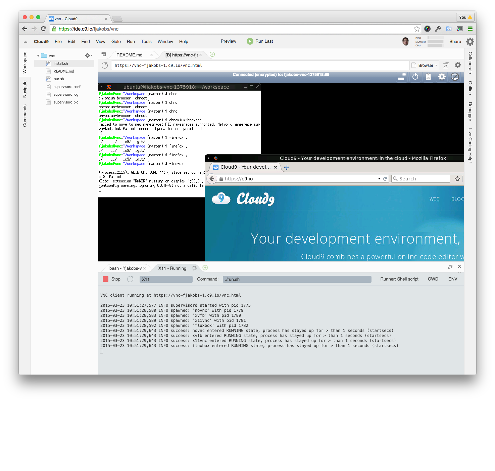

VNC
===

Running X11 in a Cloud9 workspace.

Installation
------------

Clone the repository to where you'd like (in the example I use the home folder ~)
    
    
    cd ~
    git clone https://github.com/acabey/cloud9-vnc.git
    

Enter the repository sub-directory

    cd cloud9-vnc/

Now make sure apt-get has been updated with 

    sudo apt-get update

Run the install script with privileges

    sudo ./install.sh
    
Clean up installation directory
    
    rm -rf ./

Uninstallation
--------------

Run the uninstallation script with privileges

        sudo /opt/c9vnc/uninstall.sh
    

Running
-------

Use the custom C9 runner

    Run > Run With > C9vnc
    
Run the start script symlinked into your /usr/local/bin
    
    
    c9vnc
    
    Usage: c9vnc <args>
       -h          Print this message
       -f          Run in the foreground
       -k          Kill running daemon
    No arguments will try to start daemon process
    
